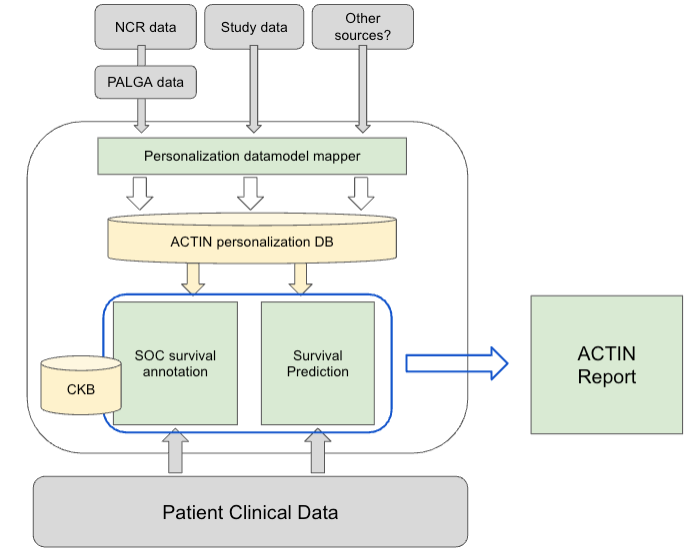

# ACTIN-Personalization

ACTIN-personalization is a system for ingesting and standardizing reference data with the purpose to create models for treatment decision
personalization for the next patient. In addition to the core datamodel and source mappings to this datamodel, this repo contains the logic
that creates the prediction models along with various analysis notebooks.

More details on the following modules are available from the links below:

| Module                   | Description                                                                                                |
|--------------------------|------------------------------------------------------------------------------------------------------------|
| [Datamodel](datamodel)   | The definition of the common reference entry datamodel used by personalization                             | 
| [Database](database)     | Code to write the common datamodel to MySQL including creating a flattened view for models to use          |
| [NCR](ncr)               | Logic to inspect and convert NCR-specific data to the common personalization datamodel                     | 
| [Prediction](prediction) | Module containing the logic to create and run the actual predictive algorithms                             |
| [Similarity](similarity) | A module providing basic patient-like-me functionality, to compare a new patient with a reference database |
